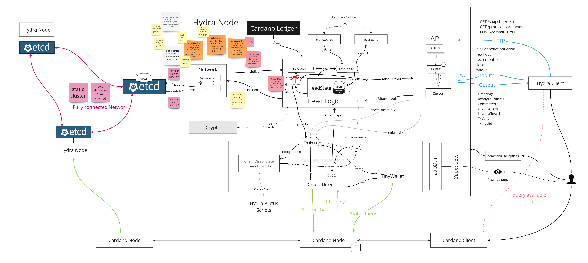

## Status

Accepted

## Context

- The communication primitive of `broadcast` is introduced in [ADR 6](/adr/6). The original protocol design in the [paper](https://eprint.iacr.org/2020/299.pdf) and that ADR implicitly assume a **reliable broadcast**.

- [ADR 27](/adr/27) further specifies that the `hydra-node` should be tolerant to the _fail-recovery_ failure model, and takes the decision to implement a _reliable broadcast_ by persisting outgoing messages and using a _vector clock_ and heartbeat mechanism, over a dumb transport layer.
  - The current transport layer in use is a simple _FireForget_ protocol over TCP connections implemented using `ouroboros-framework`.
  - [ADR 17](/adr/17) proposed to use UDP instead
  - Either this design or its implementation was discovered to be wrong, because this system did not survive fault injection tests with moderate package drops. 

- This [research paper](https://arxiv.org/pdf/1707.01873) explored various consensus protocols used in blockchain space and reminds us of the correspondence between consensus and broadcasts:

  > the form of consensus relevant for blockchain is technically known as atomic broadcast

  It also states that (back then):

  > The most important and most prominent way to implement atomic broadcast (i.e., consensus) in distributed systems prone to t < n/2 node crashes is the family of protocols known today as Paxos and Viewstamped Replication (VSR).

## Decision

- We realize that the way the off-chain protocol is specified in the paper, the `broadcast` abstraction required from the `Network` interface is a so-called _uniform reliable broadcast_. Hence, any implementation of `Network` needs to satisfy the following **properties**:

  1. **Validity**: If a correct process p broadcasts a message m, then p eventually delivers m.
  2. **No duplication**: No message is delivered more than once.
  3. **No creation**: If a process delivers a message m with sender s, then m was previously broadcast by process s.
  4. **Agreement**: If a message m is delivered by some correct process, then m is eventually delivered by every correct process.

  See also Module 3.3 in [Introduction to Reliable and Secure Distributed Programming](https://www.distributedprogramming.net) by Cachin et al, or [Self-stabilizing Uniform Reliable Broadcast by Oskar Lundström](https://arxiv.org/abs/2001.03244)

- Use [`etcd`](https://etcd.io/) as a proxy to achieve reliable broadcast via its [raft](https://raft.github.io/) consensus
  - Raft is an evolution of Paxos and similar to VSR
  - Over-satisfies requirements as it provides "Uniform total order" (satisfies [atomic broadcast](https://en.m.wikipedia.org/wiki/Atomic_broadcast) properties)
  - Each `hydra-node` runs a `etcd` instance to realize its `Network` interface
  - See the following architecture diagram which also contains some notes on `Network` interface properties:

- We supersede [ADR 17](/adr/17) and [ADR 27](/adr/27) decisions on how to implement `Network` with the current ADR.
  - Drop existing implementation of `Ouroboros` and `Reliability` components
  - Could be revisited, as in theory it would satisfy properties if implemented correctly?
  - Uniform reliable broadcast = only deliver when seen by everyone = not what we had implemented?

## Consequences

- Crash tolerance of up to `n/2` failing nodes

- Using `etcd` as-is adds a run-time dependency onto that binary.
  - Docker image users should not see any different UX
  - We can ship the binary through `hydra-node`.

- Introspectability network as the `etcd` cluster is queriable could improve debugging experience

- Persisted state for networking changes as there will be no `acks`, but the `etcd` Write Ahead Log (WAL) and a last seen revision.

- Can keep same user experience on configuration
  - Full, static topology with listing everone as `--peer`
  - Simpler configuration via [peer discovery](https://etcd.io/docs/v3.5/op-guide/clustering/#discovery) possible

- `PeerConnected` semantics needs to change to an overall `HydraNetworkConnected`
  - We can only submit / receive messages when connected to the majority cluster

- `etcd` has a few features out-of-the-box we could lean into, e.g.
  - use TLS to secure peer connections
  - separate advertised and binding addresses 
